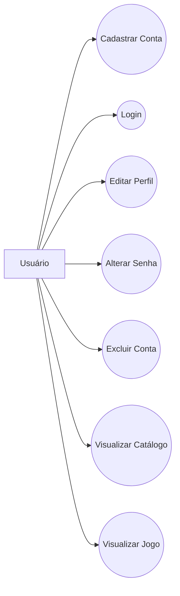
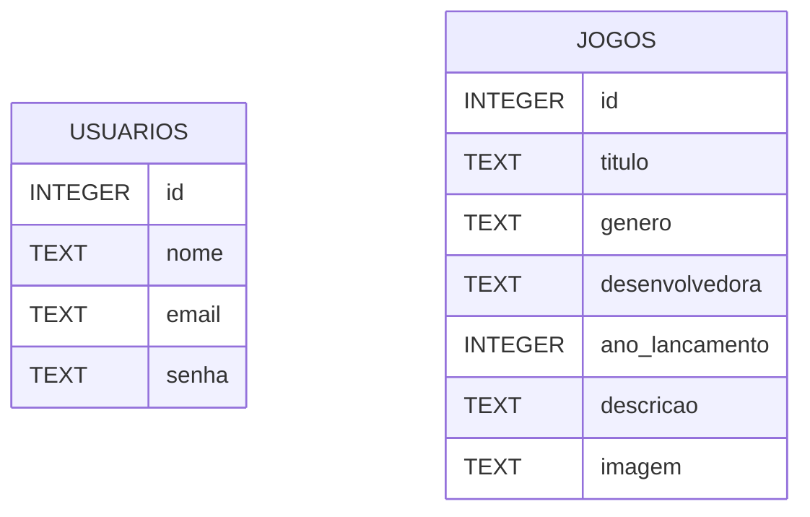
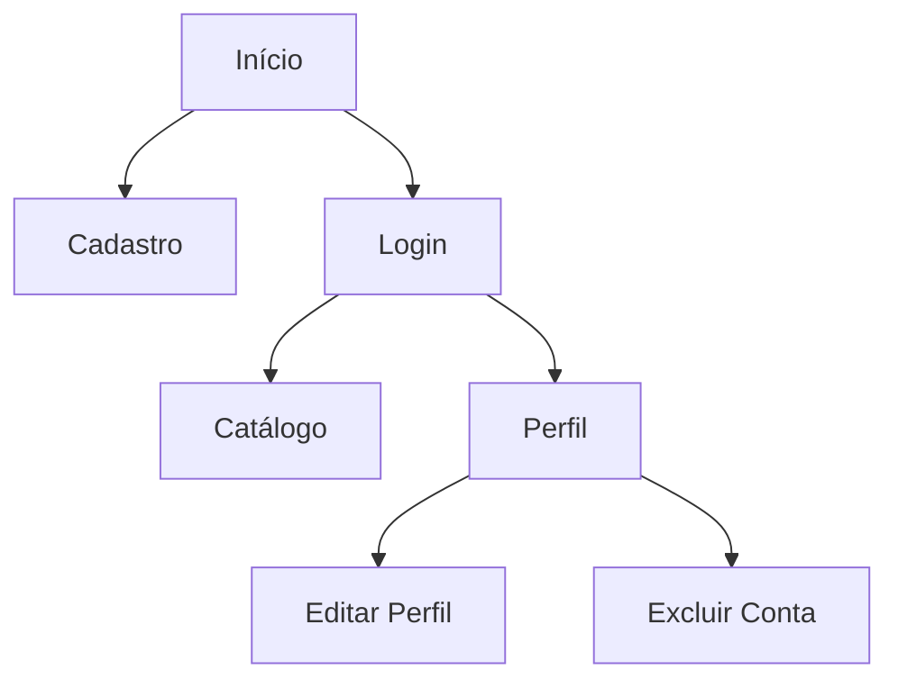

# GameVault - Catálogo de Jogos

## Projeto Integrador - Desenvolvimento Web com PHP

---

# 1. Introdução

A STEAM é um sistema web desenvolvido em PHP com banco de dados postgresql, inspirado em plataformas de distribuição digital de jogos.

O sistema permite que usuários realizem cadastro, login e gerenciamento de suas informações pessoais, além de visualizar um catálogo de jogos disponível na plataforma.

O projeto tem como objetivo aplicar os conceitos de desenvolvimento web estudados durante a disciplina, incluindo integração com banco de dados, manipulação de formulários e implementação completa do CRUD.

---

# 2. Objetivo

A STEAM permite que usuários criem uma conta, realizem autenticação e acessem um catálogo de jogos disponível, no qual o usuário pode baixar/instalar jogos, apenas para usuários cadastrados.

---
# 3.0 Como utilizar

## 3.1 Clonar o repositório

Primeiro, clone o repositório do projeto.

No GitHub a paritir deste link https://github.com/GuizineRa/backend, clique no botão verde **Code**, selecione a opção **HTTPS** e copie o link.

Abra o terminal do VS Code na pasta onde deseja salvar o projeto e execute:
git clone URL-copiada

* Após isso você digita o seguinte comando: git clone [URL-copiada], fazendo com que o meu repositório seja clonado para o seu PC

## 3.2 Banco de dados
* Após isso você deve criar o banco de dados, para isso vc deve ter instalado o postgreSQL em seu computador, Digite no BD, CREATE DATABASE e coloque o nome do seu banco (Selecione e aperte "Run query"),
```sql
CREATE TABLE usuarios (
    id SERIAL PRIMARY KEY,
    nome VARCHAR(100) NOT NULL,
    email VARCHAR(150) UNIQUE NOT NULL,
    senha_hash VARCHAR(255) NOT NULL
);
```
(Selecione e aperte "Run query").

Após isso acesse PHP/conexao.php e altere as informações abaixo:
* $host = "localhost";
* $porta = "5432";
* $banco = "steam";
* $usuario = "postgres";
* $senha = "sua_senha";
Substitua sua_Senha pela senha configurada no postgreSQL.

Inicine o servidor PHP e abra o navegador


# 4.0 Escopo

O sistema será composto por duas áreas principais.

## Área do Usuário

- Cadastro de conta.
- Login.
- Visualização de perfil.
- Alteração de dados.
- Exclusão da conta.

## Área do Catálogo

- Exibição dos jogos.
- Visualização de detalhes dos jogos.

---

# 5.0 Tecnologias Utilizadas

- PHP 8+
- postgreSQL
- PDO
- HTML
- CSS
- Git

---

# 6.0 Requisitos Funcionais

## RF01

O sistema deve permitir o cadastro de novos usuários.

## RF02

O sistema deve permitir que usuários realizem login.

## RF03

O sistema deve permitir a edição dos dados do usuário.

## RF04

O sistema deve permitir a alteração de senha.

## RF05

O sistema deve permitir a exclusão da conta.

## RF06

O sistema deve exibir um catálogo de jogos.

## RF07

O sistema deve exibir detalhes dos jogos cadastrados.

## RF08

O sistema deve impedir o acesso ao catálogo sem autenticação.+

---

# 6. Requisitos Não Funcionais

## RNF01

O sistema deve utilizar postgresql como banco de dados.

## RNF02

O sistema deve utilizar PHP como linguagem backend.

## RNF03

As senhas devem ser armazenadas utilizando hash.

## RNF04

A interface deve ser acessível via navegador web.

## RNF05

O sistema deve possuir organização modular dos arquivos.

---

# 8.0 Casos de Uso

## Ator Principal

- Usuário

## Casos de Uso

- Criar conta
- Realizar login
- Editar perfil
- Alterar senha
- Excluir conta
- Visualizar catálogo
- Visualizar detalhes do jogo

---

# 9.0 Diagrama de Casos de Uso



---

# 10.0 Modelo Entidade-Relacionamento



---

# 11.0 Banco de Dados

## Tabela usuarios

```sql
CREATE TABLE usuarios (
    id SERIAL PRIMARY KEY,
    nome VARCHAR(100) NOT NULL,
    email VARCHAR(255) UNIQUE NOT NULL,
    senha VARCHAR(255) NOT NULL
);
```

---

# 12.0 Estrutura de Arquivos

```text
PROJETO-FINAL-PHP/
├── CSS
|    └── cadastro.css
│    └── index.css
|    └── login.css
│    └── perfil.css
|
├── HTML
│    └── cadastro.php
|    └── index.php
│    └── login.php
|    └── perfil.php
|   
├── PHP
|    └── cadastrar.php
|    └── cadastro.php
|    └── conexao.php
|    └── login.php
|    └── script-index.php
│
└── imagens/
```

---

# 13.0 Operações CRUD

## CREATE

Responsável pelo cadastro de novos usuários.

```sql
INSERT INTO usuarios (nome, email, senha)
VALUES (?, ?, ?);
```

## READ

Responsável pela consulta dos dados do usuário.

```sql
SELECT * FROM usuarios;
```

## UPDATE

Responsável pela atualização das informações do usuário.

```sql
UPDATE usuarios
SET nome = ?, email = ?, senha = ?
WHERE id = ?;
```

## DELETE

Responsável pela exclusão da conta.

```sql
DELETE FROM usuarios
WHERE id = ?;
```

---

# 14.0 Fluxo de Navegação



---

# 15.0 Segurança

As seguintes práticas serão utilizadas:

- Prepared Statements para consultas SQL.
- PDO para acesso ao banco de dados.
- Armazenamento seguro de senhas utilizando `password_hash()`.
- Validação de formulários.
- Controle de sessão através de `$_SESSION`.
- Proteção contra SQL Injection.

---

# 16.0 Checklist dos Requisitos da Atividade

| Requisito | Status |
|------------|---------|
| Planejamento do sistema | ✔ |
| Banco postgresql | ✔ |
| CREATE | ✔ |
| READ | ✔ |
| UPDATE | ✔ |
| DELETE | ✔ |
| Organização dos arquivos | ✔ |
| Conexão reutilizada | ✔ |
| Código comentado | ✔ |
| Fluxo funcional completo | ✔ |

---

# 17.0 Possíveis Melhorias Futuras

- Sistema de favoritos.
- Biblioteca de jogos do usuário.
- Sistema de avaliações.
- Comentários em jogos.
- Upload de foto de perfil.
- Recuperação de senha.

---

# 18.0 Protótipo do projeto criado no figma

https://www.figma.com/design/08rbjdcqau0X0ajkCM1WL4/Steam?node-id=6-38&t=8NOrg2aqM20zZaQK-1
